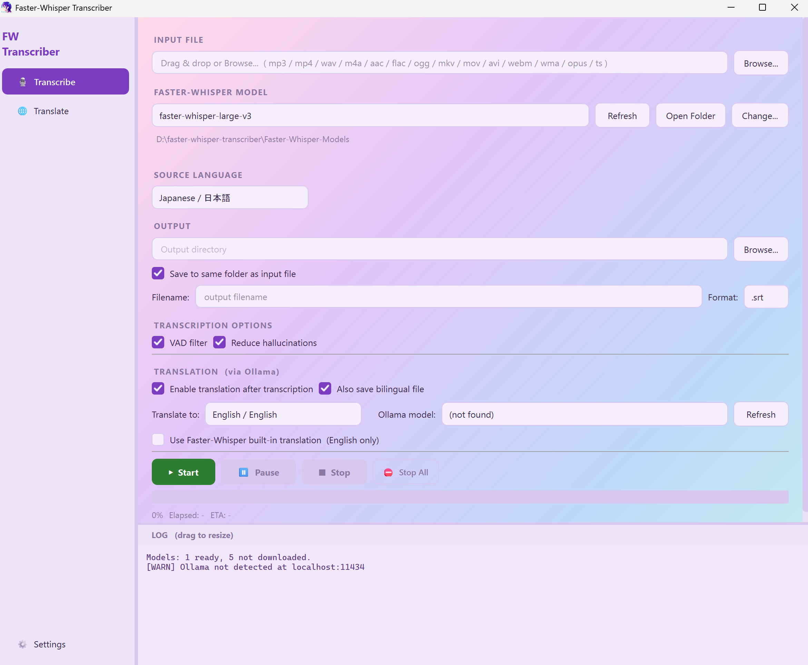

<div align="center">


# Faster-Whisper Transcriber

A local, GPU-accelerated speech-to-text and subtitle-translation desktop app.
Transcription runs on **faster-whisper**; translation runs on a local **Ollama** model.
Nothing leaves your machine — no cloud, no API keys, no per-request cost.


[](LICENSE)
[](https://github.com/Kuranushi/faster-whisper-transcriber/releases)
[](https://github.com/Kuranushi/faster-whisper-transcriber/commits)

[](https://github.com/Kuranushi/faster-whisper-transcriber/stargazers)

</div>

<p align="center">
  
</p>

---

## ⚡ Quick Start

1. **Download** this repo (`Code → Download ZIP`, or `git clone`).
2. Run **`Setup.bat`** — one time only.
   - Downloads a portable, embeddable Python 3.11 *just for this app* — your system Python, if you have one, is left untouched.
   - Installs everything in `requirements.txt`, plus the NVIDIA CUDA libraries needed for GPU transcription.
   - Takes a few minutes. If it fails partway, just run it again — completed steps are skipped.
3. Run **`Run.bat`** to launch (no console window), or **`Run_debug.bat`** to see console output/errors.
4. Drop an audio/video file into the window, pick a model, hit **Start**.

Optional: run `Create_Shortcut.bat` once for a `.lnk` shortcut you can pin or move wherever you like.

Want subtitle translation too? You'll also need **Ollama** installed and running, with at least one model pulled — see **Requirements** below.

---

## ✨ Features

- **Local speech-to-text** — [faster-whisper](https://github.com/SYSTRAN/faster-whisper) / CTranslate2, `tiny` through `large-v3` / `large-v3-turbo`, auto-downloaded on first use with integrity checks and automatic cleanup of corrupt downloads.
- **GPU-accelerated, automatic CPU fallback** — uses your NVIDIA GPU when found; otherwise switches to CPU (int8) on its own instead of failing.
- **Local subtitle translation** via a locally-running **Ollama** model — 11 target languages. Requests are batched (several lines per call, not one call per line) to keep cross-line context and cut translation time.
- **Bilingual subtitles** — original and translation together in one file.
- **Standalone Translate tab** — translate an existing `.srt` / `.vtt` / `.txt` directly, no re-transcription needed.
- **Batch processing** on both tabs — drop in multiple files, they queue automatically.
- **Granular playback controls** — Pause, Stop (current step only), and Stop All. A Stop never discards work already produced.
- **29 source languages** + auto-detect; the dropdown remembers what you use most and sorts it to the top.
- **5 built-in skins**, switchable instantly, plus an optional custom background image with adjustable overlay opacity.
- Native **Windows taskbar progress** indicator while a job runs.

---

## 🖥 Requirements

| | |
|---|---|
| OS | Windows 10 / 11, 64-bit |
| Python | None needed — `Setup.bat` provisions its own portable copy |
| GPU | NVIDIA GPU + a recent driver, **recommended** (CUDA). No GPU? It runs on CPU automatically — slower, but works. |
| [Ollama](https://ollama.com) | Needed only for **translation**. Install it, keep it running, pull at least one model (e.g. `ollama pull qwen2.5`). Transcription alone works without it. |
| Disk space | A few GB free — models range from ~75 MB (`tiny`) to ~3.1 GB (`large-v3`), and only download when you actually pick them |

---

## 🎬 Usage

### Transcribe tab
1. Drop in one or more audio/video files (`.mp3 .mp4 .wav .m4a .aac .flac .ogg .mkv .mov .avi .webm` and more).
2. Pick a model — models not yet on disk show a `↓` and download automatically the moment you select them.
3. Pick a source language, or leave it on **Auto Detect**.
4. Set your options (see **Tips** below), output format, and output folder.
5. Optionally check **Enable translation after transcription** for a translated (and, if you want, bilingual) subtitle file in the same run.
6. Hit **Start**.

For an input named `lecture`, format `.srt`, translated into some target language, you'll get:
```
lecture.srt                  ← original transcript
lecture.<lang>.srt           ← translated
lecture.<lang>.bilingual.srt ← original + translation, line by line
```

### Translate tab
Already have subtitles and just need another language? Drop `.srt` / `.vtt` / `.txt` files here directly — same batching, same bilingual option, no transcription step involved.

---

## 💡 Tips & Best Practices

- **VAD filter** and **Reduce hallucinations** are both on by default, and that's the right call for **long** recordings — lectures, podcasts, meetings. They noticeably cut down on repeated or hallucinated text.
- For **short clips and music videos**, try turning **both off**. In testing, results were consistently better that way — VAD tends to cut into vocals over music, and hallucination reduction can lose the thread on very short, low-context audio.
- A model download that fails or gets interrupted doesn't need manual cleanup — the app detects the incomplete folder and re-downloads it next time you pick that model.

---

## 🎨 Themes

Five built-in skins — Sakura Mist, Arctic Clarity, Matcha Calm, Twilight Plum, Fluent Glass — switchable anytime from Settings, no restart required. Add your own background image with adjustable overlay opacity.

---

## 🙏 Acknowledgments

- [faster-whisper](https://github.com/SYSTRAN/faster-whisper) & [CTranslate2](https://github.com/OpenNMT/CTranslate2) — the transcription engine
- [Ollama](https://ollama.com) — local LLM runtime used for translation
- [PySide6](https://doc.qt.io/qtforpython/) — GUI framework
- Model weights via [Hugging Face](https://huggingface.co), converted by [Systran](https://huggingface.co/Systran) and [deepdml](https://huggingface.co/deepdml)

---

## 📄 License

Code is licensed under [MIT](LICENSE).

The app icon (`icon.ico`) is **not** covered by the MIT license — all rights reserved. See [LICENSE](LICENSE) for the exact terms.
